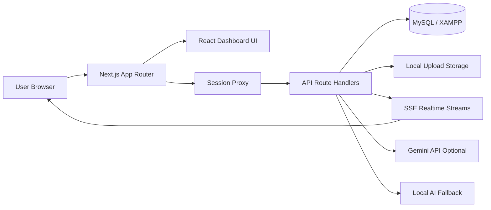
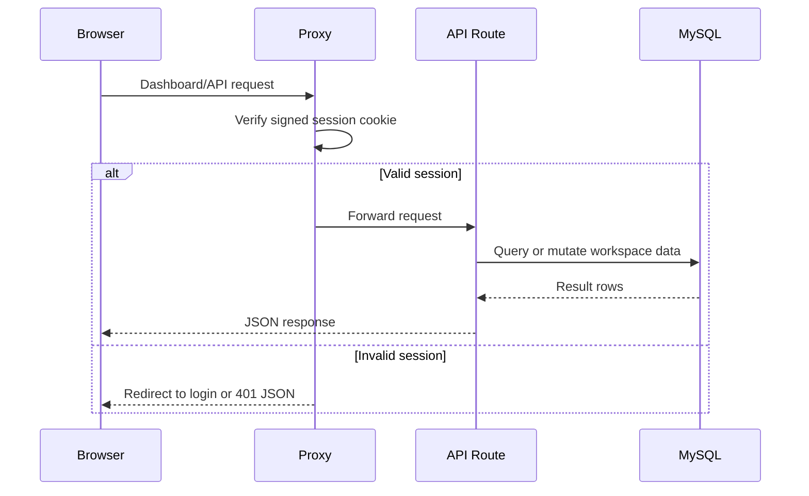
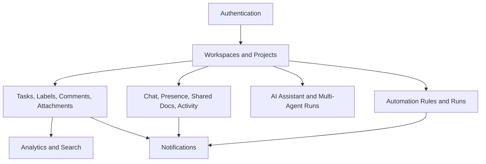
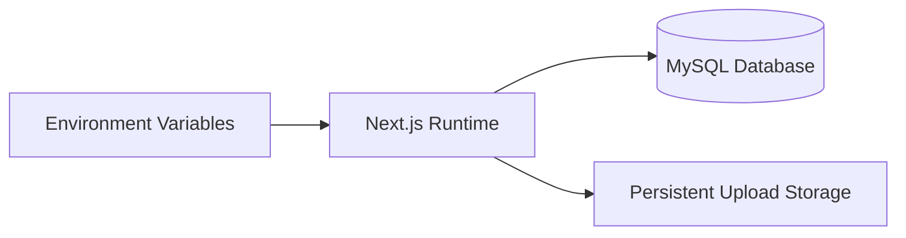

# System Architecture

TaskFlow AI is a full-stack productivity workspace built around a Next.js application, MySQL persistence, server-side API route handlers, and optional AI provider integration.

## High-Level Architecture

## Runtime Components

- `app/`: Next.js App Router pages and API route handlers.
- `components/`: dashboard, landing, auth, and shared UI components.
- `lib/`: shared service modules for database, auth/session, API utilities, AI, automation, realtime, notifications, and mentions.
- `database/`: MySQL schema, seed data, migration, backup, restore, and test database scripts.
- `public/uploads/`: local task attachment storage.
- `backend/`: FastAPI scaffold reserved for future Python service expansion.

## Request Flow

## Data and Feature Areas

## Deployment Shape

Minimum required environment:

- `DB_HOST`
- `DB_PORT`
- `DB_USER`
- `DB_PASSWORD`
- `DB_NAME`
- `AUTH_SECRET`

Optional integrations:

- `NEXT_PUBLIC_GOOGLE_CLIENT_ID`
- `GEMINI_API_KEY`
- `GEMINI_MODEL`
