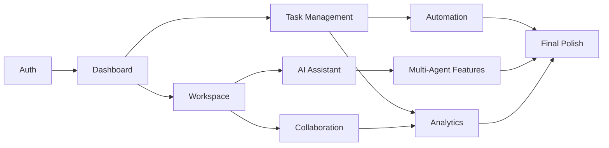

# Recommended Build Order

The recommended build order has been completed. This file maps each planned build phase to its implementation evidence and verification coverage.

## Build Sequence Evidence

| Order | Build Phase | Evidence |
| --- | --- | --- |
| 1 | Auth | `app/(auth)`, `app/api/auth`, `lib/session.ts`, `lib/password.ts`, protected `proxy.ts` |
| 2 | Dashboard | `app/(dashboard)/dashboard/page.tsx`, dashboard shell, sidebar/header navigation |
| 3 | Task management | `app/(dashboard)/dashboard/tasks/page.tsx`, `app/api/tasks`, labels, comments, attachments |
| 4 | Workspace | `app/(dashboard)/dashboard/workspaces`, workspace/project/member APIs |
| 5 | AI assistant | `app/(dashboard)/dashboard/assistant/page.tsx`, assistant APIs, `lib/ai.ts` |
| 6 | Collaboration | collaboration page, chat/doc/presence/stream APIs, realtime and mention helpers |
| 7 | Automation | automation page, automation APIs, automation run execution helpers |
| 8 | Multi-agent features | agents APIs, `lib/multi-agent.ts`, persisted agent run/step schema |
| 9 | Analytics | analytics page/API, reports export, productivity/team metrics |
| 10 | Final polish | responsive UI shell, accessibility pass, deliverables, tests, production build verification |

## Dependency Flow



## Verification

Run:

```powershell
npm.cmd run test:build-order
```

Recommended full confidence pass:

```powershell
npm.cmd test
npm.cmd run test:goals
npm.cmd run test:deliverables
npm.cmd run test:build-order
npm.cmd run test:types
npm.cmd run test:build
```
