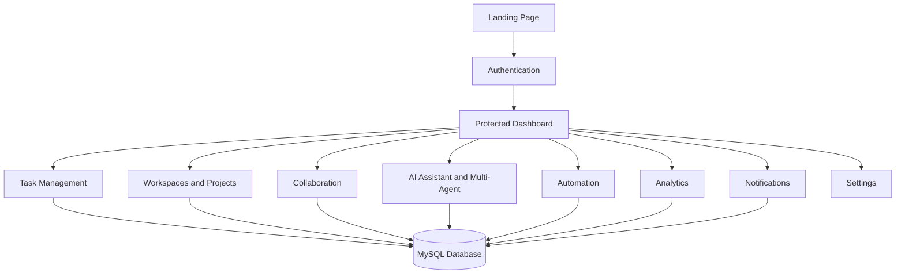

# Final Product Goals

TaskFlow AI is complete as a SaaS-style AI productivity platform prototype. Each final product goal is backed by implemented routes, APIs, database tables, tests, and documentation.

## Goal Coverage

| Goal                          | Implementation Evidence                                                                                                      |
| ----------------------------- | ---------------------------------------------------------------------------------------------------------------------------- |
| AI productivity platform      | AI assistant page, prompt templates, Gemini integration path, local fallback AI responses, usage logging, workspace context  |
| Task management system        | Task CRUD APIs, list/Kanban/calendar UI, labels, subtasks, comments, attachments, due dates, priority/status filtering       |
| Multi-agent workspace         | Multi-agent run APIs, planner/scheduler/research/automation agents, persisted run history and step traces                    |
| Collaboration tool            | Workspace chat, shared docs, task comments, mentions, presence updates, activity feed, SSE streams                           |
| Workflow automation tool      | Automation builder UI, trigger-action rules, manual execution, recurring/follow-up task support, execution logs              |
| Analytics dashboard           | Productivity metrics, completion trends, priority breakdowns, workspace/team performance, AI-style insights, CSV export      |
| SaaS-style full stack product | Landing page, auth, protected dashboard, settings, notification center, MySQL schema, API middleware, tests, deployment docs |

## Product Surface

## Acceptance Summary

- The prototype builds successfully with `npm.cmd run test:build`.
- Product wiring is covered by `npm.cmd test`.
- Final deliverables are covered by `npm.cmd run test:deliverables`.
- Product goal evidence is covered by `npm.cmd run test:goals`.
- The local app has been verified at `http://localhost:3000`.

## Remaining External Configuration

The only known external verification item is Google OAuth live-client validation. The code path exists, but it needs `NEXT_PUBLIC_GOOGLE_CLIENT_ID` from a real Google Cloud project.
