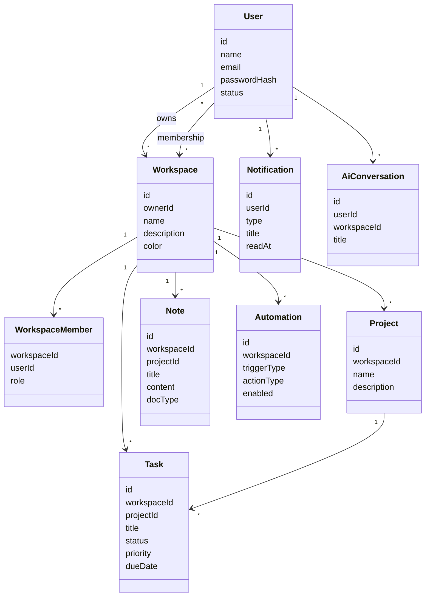
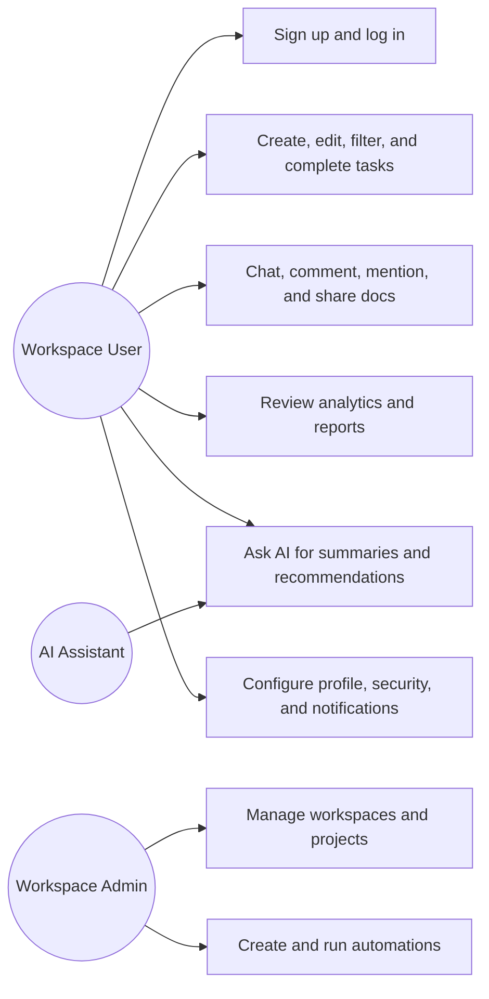
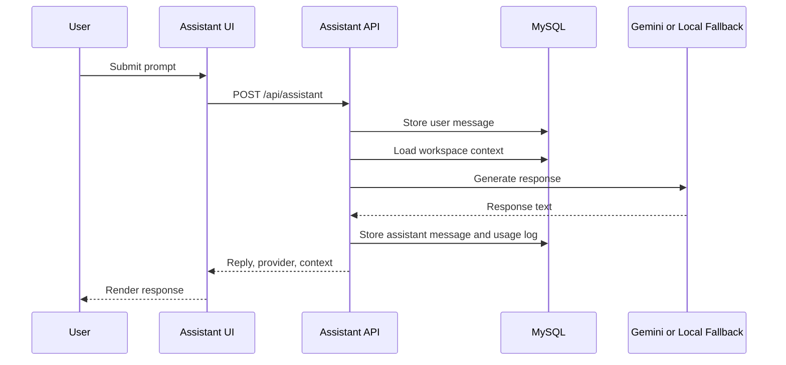
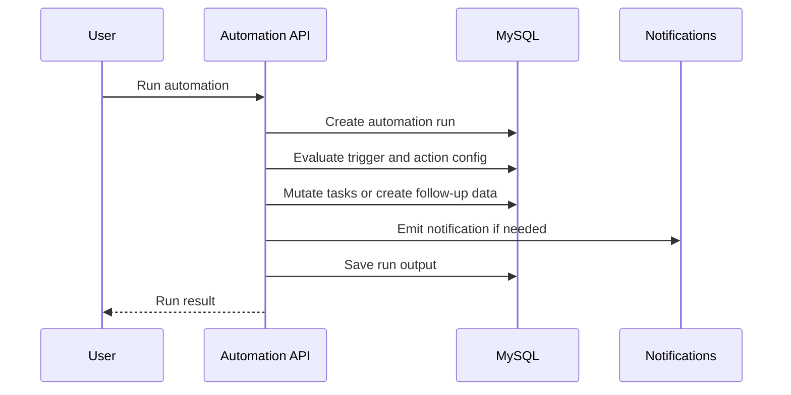

# UML Diagrams

## Core Domain Class Diagram

```mermaid
classDiagram
  class User {
    id
    name
    email
    passwordHash
    status
  }

  class Workspace {
    id
    ownerId
    name
    description
    color
  }

  class WorkspaceMember {
    workspaceId
    userId
    role
  }

  class Project {
    id
    workspaceId
    name
    description
  }

  class Task {
    id
    workspaceId
    projectId
    title
    status
    priority
    dueDate
  }

  class Note {
    id
    workspaceId
    projectId
    title
    content
    docType
  }

  class Automation {
    id
    workspaceId
    triggerType
    actionType
    enabled
  }

  class Notification {
    id
    userId
    type
    title
    readAt
  }

  class AiConversation {
    id
    userId
    workspaceId
    title
  }

  User "1" --> "*" Workspace : owns
  User "*" --> "*" Workspace : membership
  Workspace "1" --> "*" WorkspaceMember
  Workspace "1" --> "*" Project
  Workspace "1" --> "*" Task
  Project "1" --> "*" Task
  Workspace "1" --> "*" Note
  Workspace "1" --> "*" Automation
  User "1" --> "*" Notification
  User "1" --> "*" AiConversation
```

## Use Case Diagram

```mermaid
flowchart LR
  user((Workspace User))
  admin((Workspace Admin))
  ai((AI Assistant))

  login[Sign up and log in]
  manageWorkspace[Manage workspaces and projects]
  manageTasks[Create, edit, filter, and complete tasks]
  collaborate[Chat, comment, mention, and share docs]
  automate[Create and run automations]
  analyze[Review analytics and reports]
  askAI[Ask AI for summaries and recommendations]
  configure[Configure profile, security, and notifications]

  user --> login
  user --> manageTasks
  user --> collaborate
  user --> analyze
  user --> askAI
  user --> configure
  admin --> manageWorkspace
  admin --> automate
  ai --> askAI
```

## AI Assistant Sequence

```mermaid
sequenceDiagram
  participant U as User
  participant UI as Assistant UI
  participant API as Assistant API
  participant DB as MySQL
  participant AI as Gemini or Local Fallback

  U->>UI: Submit prompt
  UI->>API: POST /api/assistant
  API->>DB: Store user message
  API->>DB: Load workspace context
  API->>AI: Generate response
  AI-->>API: Response text
  API->>DB: Store assistant message and usage log
  API-->>UI: Reply, provider, context
  UI-->>U: Render response
```

## Automation Run Sequence

```mermaid
sequenceDiagram
  participant U as User
  participant API as Automation API
  participant DB as MySQL
  participant N as Notifications

  U->>API: Run automation
  API->>DB: Create automation run
  API->>DB: Evaluate trigger and action config
  API->>DB: Mutate tasks or create follow-up data
  API->>N: Emit notification if needed
  API->>DB: Save run output
  API-->>U: Run result
```
